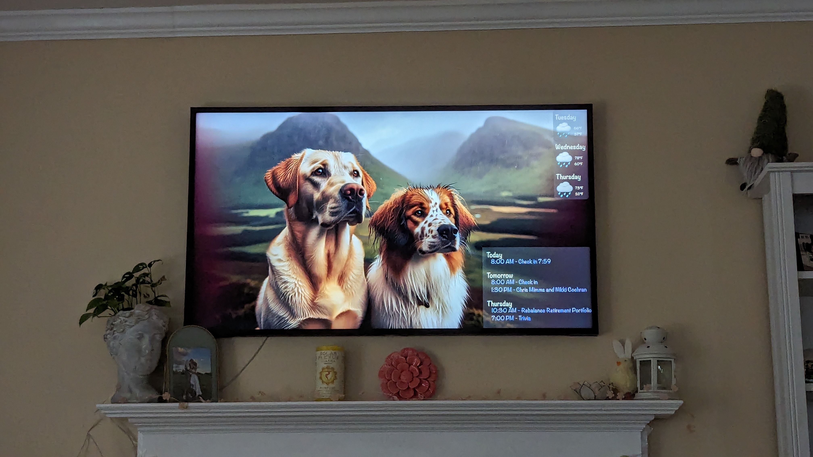

# Description

This project generates a new image of my dogs daily, and overlays 3 days of weather and my calendar. The resulting image is uploaded and displayed on Frame TV art mode so it's the first thing I see in the morning.

# Next Steps and Ideas
* Image Generation
    * Generate images every day with special occasions from the calendar
    * Change the time of day in the image over the day, morning, noon, night
    * ~~Image generation takes current weather into account~~
* Other image sources
    * Support online image search
    * Generate views of current night sky with constellations using Stellarium or similar
* Image overlays
    * ~~Overlay daily schedule on images in the morning~~
    * ~~Implement a weather forecast feature to display the current weather conditions on the images.~~
        * Current phase of the moon
    * Integrate with a news API to display the latest news headlines on the images. (Don't do this)
    * Add a countdown feature to display the number of days until a specific event or holiday.
    * Random quote generator and display a new quote on the images each day.
    * Reminder system to display important tasks or events for the day on the images.
    * Recipe suggestions or recipe of the day based off meal plan
    * "On this day in history"
* Integrations and scheduling
    * Add Alexa integration to replace images on the fly
    * Schedule new images daily or multiple times a day

# Libraries Used
https://github.com/xchwarze/samsung-tv-ws-api
https://github.com/marysieek/samsung-tv-api
https://github.com/kuzmoyev/google-calendar-simple-api

# Setup
Create .env and credentials.json files with secrets. Credentials instructions are in the google-calendar library docs above. Make sure Frame TV has a static IP and update in art.py. According to [this](https://tavicu.github.io/homebridge-samsung-tizen/configuration/frame-tvs.html) the art mode api was removed from 2022+ Frame TVs so this will not work on those models.